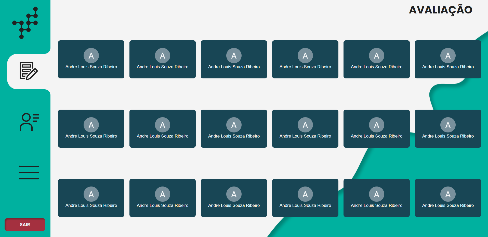
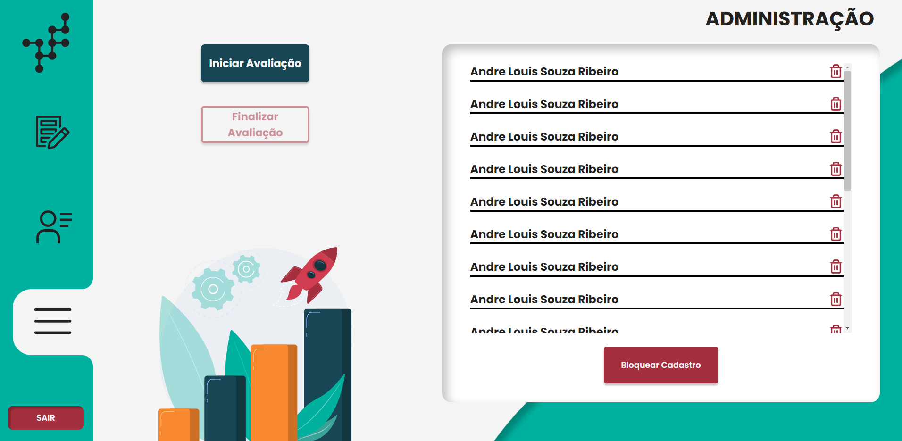

# Avaliação 360 PET - Eng. Comp.

# Tecnologias
- ReactJs
- NextJs
- Google SpreadSheet

# O que é?
-  O site foi criado com o intuito de de facilitar o método de avaliação dos Petianos do PET de engenharia de computação da UFES.
-  Todo semestre do ano, o PET faz uma avaliação onde todos avaliam todos, referente a como eles estão se comportando dentro do PET. Antes da ideia do site, o Tutor tinha que criar um Forms do Google, esperar que todos avaliassem e depois pegar os resultados, separar por petianos e enviar diretamente para os mesmos. Com o site, isso foi facilitado e conseguiu-se manter o sigilo total.

# Como funciona?
- Os usuários Petiano e Tutor podem acessar suas avaliações de períodos anteriores.

 

- Os usuários Petiano e Tutor podem avaliar outros colegas caso o Tutor tenha liberado uma nova avaliação.

 

- O usuário Tutor tem uma aba de administração que pode excluir pessoas, liberar o cadastro na plataforma ou iniciar/finalizar uma avaliação

 

# Qual o diferencial?
- Para facilitar e agilizar a criação do site, foi utilizada a ferramente Google SpreadSheet para armazenamento dos dados referentes as votações. Com isso, podemos manter o sigilo dos votos e controle total do organizador (Tutor do PET).
- Além disso, para controle dos usuários foi utilizado o login proveniente do Google, mais especificamente, com o domínio @ufes, para não haver nenhum problema quanto a nomes e logins indesejados.

 

# Desenvolvedores
- <a href="https://github.com/BrunoAngeloti">Bruno Angeloti</a>
- <a href="https://github.com/aandrelouis">André Louis </a>
- <a href="https://github.com/andreocunha">André Cunha </a>

# Designers
- <a href="https://github.com/BrunoAngeloti">Bruno Angeloti </a>
- <a href="https://www.instagram.com/lorenmoraes/">Lorraynne Modolo </a>
- <a href="https://github.com/Laratb1">Lara Tagarro </a>
- <a href="https://github.com/victoriapoltronieri">Victoria Louzada </a>
